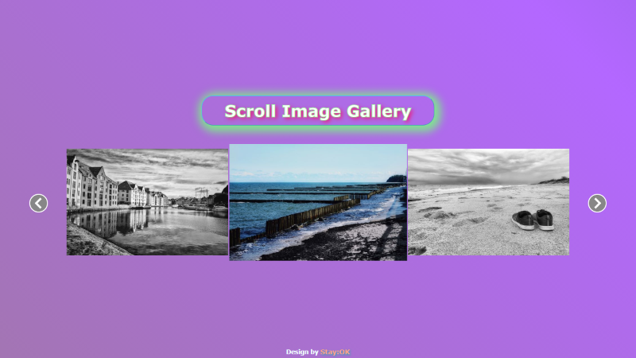

# Gallery app with horizontal scroll
#### What has been implemented:
* gallery has responsive screen width for different device types
* using javascript, images are moved horizontally by a given width
* animated linear gradient applied to gallery background
* images are expanded on click to a larger format (popup-image)
* click here => [_**Scroll Image Gallery**_](https://bakna2t.github.io/gallery/)
___
